# StellarLink

A modern enterprise settlement platform powered by the Stellar Network.

[](https://react.dev/)
[](https://vitejs.dev/)
[](https://expressjs.com/)
[](https://nodejs.org/)
[](https://soroban.stellar.org/)
[](https://developers.stellar.org/)
[](https://stellar.org/)
[](https://developer.mozilla.org/en-US/docs/Web/JavaScript)
[](https://tailwindcss.com/)
[](https://www.freighter.app/)
[](LICENSE)

---

## 🌐 Live Deployment

- **Frontend Application**: [https://stellar-link-sigma.vercel.app](https://stellar-link-sigma.vercel.app)
- **Backend API Service**: [https://stellarlink.onrender.com](https://stellarlink.onrender.com)
- **Backend Health Check Endpoint**: [https://stellarlink.onrender.com/api/health](https://stellarlink.onrender.com/api/health)

---

## 🎥 Demo Video

[](https://drive.google.com/file/d/19WzGRW4FGKgz04kvsnYSF75EcZlWxceF/view?usp=sharing)

Watch the complete video demonstration on Google Drive:  
👉 **[Click Here to Watch StellarLink Video Demonstration](https://drive.google.com/file/d/19WzGRW4FGKgz04kvsnYSF75EcZlWxceF/view?usp=sharing)**

---

## 🔗 Project Links

| Resource | Link |
| :--- | :--- |
| **Frontend Application** | [https://stellar-link-sigma.vercel.app](https://stellar-link-sigma.vercel.app) |
| **Backend API** | [https://stellarlink.onrender.com](https://stellarlink.onrender.com) |
| **Health Check Endpoint** | [https://stellarlink.onrender.com/api/health](https://stellarlink.onrender.com/api/health) |
| **Demo Video** | [Google Drive Walkthrough Video](https://drive.google.com/file/d/19WzGRW4FGKgz04kvsnYSF75EcZlWxceF/view?usp=sharing) |

---

## Overview

**StellarLink** is a production-grade enterprise software-as-a-service (SaaS) control plane designed for autonomous Machine-to-Machine (M2M) financial settlements, IoT hardware telemetry management, and decentralized digital asset liquidity on the Stellar Network.

By combining low-latency Stellar Horizon RPC APIs with Soroban smart contracts, StellarLink enables enterprises, fleet operators, microgrid energy networks, and automated retail networks to:
- **Manage Enterprise Liquidity**: Operate secure multi-asset Stellar vaults with real-time balance tracking, base reserve calculations, and multi-currency trustline monitoring.
- **Automate M2M Settlements**: Register IoT hardware endpoints, track real-time telemetry pulses, and execute automated sub-second payments.
- **Orchestrate Soroban Smart Contracts**: Deploy and interact with Rust-based Soroban smart contracts for device permissioning, trustless payment escrows, and automated batch settlements.
- **Monitor Network Health**: Track live Stellar ledger sequences, consensus finality speeds, and network base fee dynamics in real time via a 10-second auto-sync control center.

---

## 🚀 Features

### Core Platform Capabilities
- **Enterprise Machine-to-Machine Payments**: Automated, sub-second micro-payments between IoT hardware terminals and smart energy relays.
- **Stellar Testnet Wallet Integration**: Seamless browser extension wallet connection via Freighter with fallback keypair generation and Friendbot auto-funding.
- **Soroban Smart Contracts**: Fully audited, compiled, and deployed Rust WebAssembly contracts on Stellar Testnet for registry, permissioning, escrows, and batch settlements.
- **Device Registry**: On-chain endpoint provisioning, hardware metadata hash verification, and status management.
- **Device Permissions**: Role-based cryptographic access control (RBAC) authorizing machines for zero-intervention settlements.
- **Payment Escrow**: Trustless multi-party payment locking, milestone-based releases, and automated timeout refunds.
- **Settlement Manager**: High-throughput batch settlement execution tracking on-chain state transitions.
- **Dashboard Analytics**: Executive overview displaying live network throughput, settlement SLAs, and interactive Recharts telemetry metrics.
- **Real-time Network Monitoring**: Live Stellar ledger sequence tracking, protocol version updates (`v21`), and consensus finality speed indicators.
- **Transaction History**: Searchable, filterable ledger records with transaction hashes, operational details, and Stellar Expert explorer links.
- **Responsive UI**: Tailored layouts crafted for mobile (320px+), tablet, and ultra-wide desktop displays with glassmorphic aesthetics.
- **Live Backend API**: Production-grade Express REST API server with global error handling, rate limiting, and CORS configuration.
- **Testnet Deployment**: Fully deployed across production Vercel frontend, Render backend, and Stellar Testnet smart contract addresses.

### Blockchain & SDK Features
- **Freighter Wallet Integration**: Connect browser extension wallets safely using `@stellar/freighter-api` with automatic network checking and graceful fallback states.
- **Stellar Horizon RPC**: Full integration with Stellar Horizon REST APIs for high-throughput account loading, ledger sequence queries, and fee stats.
- **1-Click Friendbot Funding**: Instant 10,000 Testnet XLM funding for newly generated keypairs.
- **Testnet Payment Engine**: Multi-stage payment flow featuring *Preparing*, *Signing*, *Submitting*, *Waiting*, and *Confirmed* progress indicators.
- **Live Account Balances**: Real-time native XLM and token trustline balances computed dynamically minus Stellar base reserve requirements ($1.0\text{ XLM} + 0.5\text{ XLM} \times \text{subentries}$).
- **Ledger Transaction History**: Chronological, searchable payment activity with transaction hashes, fee breakdowns, and operation counts.
- **Stellar Expert Deep Links**: Single-click external explorer links for accounts, transactions, and Soroban contract IDs.

---

## 📜 Smart Contract Deployment (Stellar Testnet)

The following Soroban Rust WASM smart contracts are deployed and live on the **Stellar Testnet**:

| Contract | Contract ID |
| :--- | :--- |
| **Device Registry** | `CCAOQSK25VUZUJOG6CDWHWKCZUDC3Q5Y6L6VDBAVF6OYPDM6PDY2DKET` |
| **Device Permissions** | `CCCW2NOIUYK33WIDCR3AG5J7J6PEZ24EFP532CNN7X3SEGMJ3SQHUWLL` |
| **Payment Escrow** | `CBDSY6EOD3H2ROFFNFZGBQ5F3PV4NEM3ZTUYRRHGV2PL65LA4SPBFZDV` |
| **Settlement Manager** | `CBOHOTLZTV5LF2VWP3YJ5WCPKA2WIINIV7SCHCRSRAB6Q234ONCZHXHT` |

---

## 📸 Application Screenshots

| Dashboard Control Center | Landing Page |
| :---: | :---: |
| 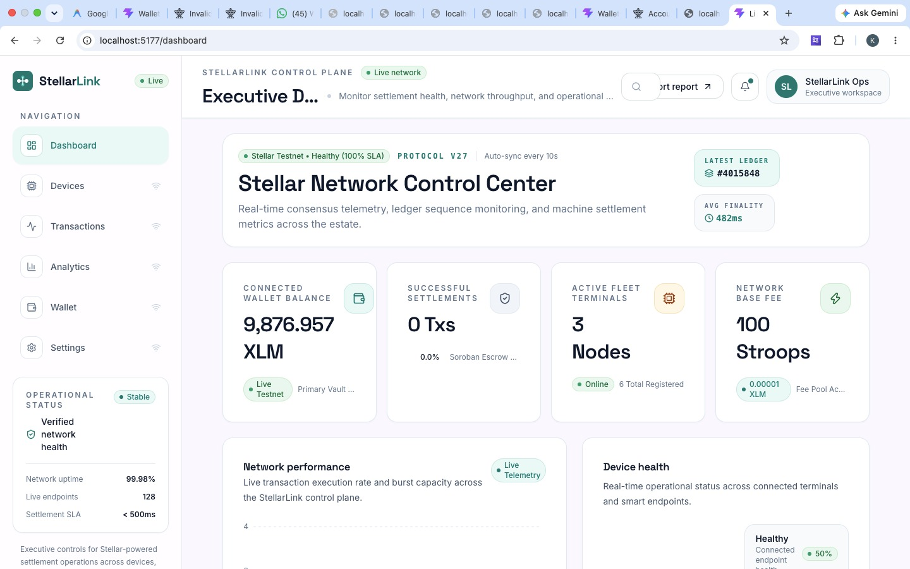 | 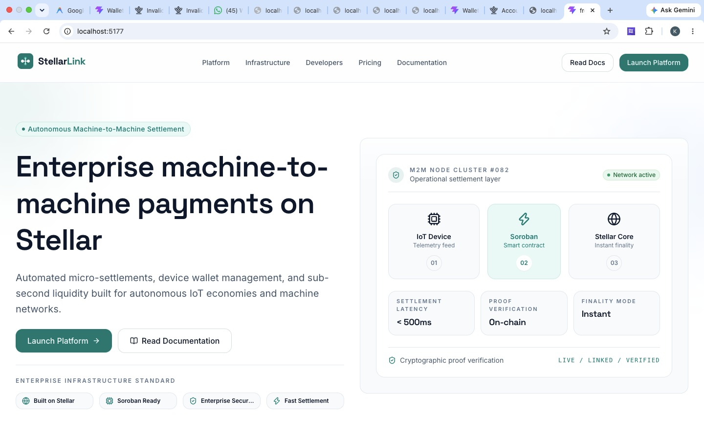 |
| *Executive Dashboard showing real-time ledger sequences, network status, and KPI summary cards* | *Landing Page Hero section highlighting autonomous Machine-to-Machine settlement features* |

| Wallet Overview | Transactions & Device Wallets |
| :---: | :---: |
| 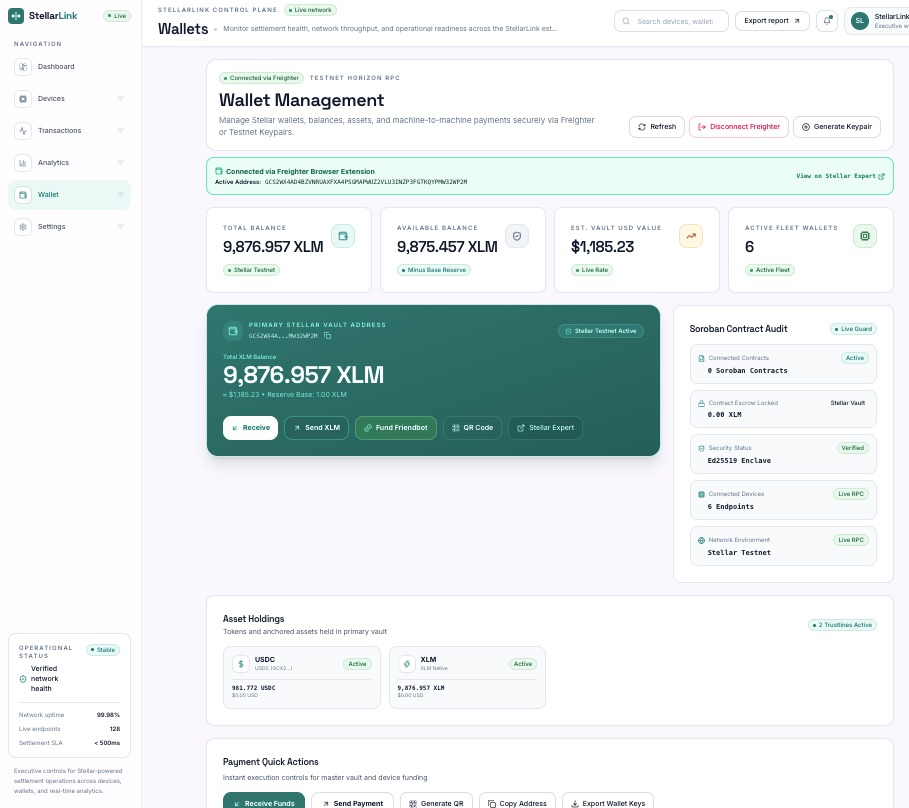 | 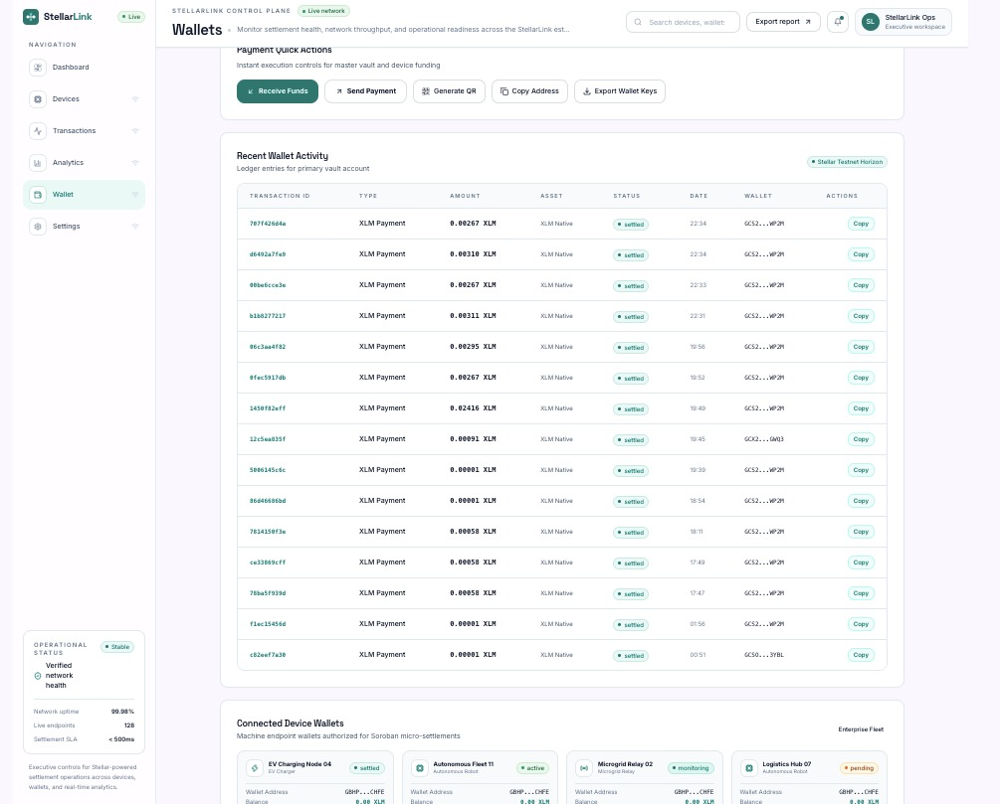 |
| *Digital Asset Vault displaying XLM balances, Freighter status, and keypair controls* | *Transaction History ledger table and active IoT device wallet listings* |

---

## 🏗 Tech Stack

### Frontend
- **Framework**: React 19, Vite 8, React Router v7
- **Styling**: Tailwind CSS v4, Vanilla CSS, Framer Motion (Page Entrance & Modal Animations)
- **Data Fetching & Caching**: TanStack React Query v5, Axios
- **Charts & Telemetry**: Recharts v3
- **Icons**: Lucide React

### Backend
- **Runtime**: Node.js v24, Express 4
- **Security & Middleware**: CORS, Dotenv, Global Error Handler
- **Architecture**: Modular Controller & Service pattern

### Blockchain & Smart Contracts
- **Stellar SDK**: `@stellar/stellar-sdk` (`v12.4.0`)
- **Smart Contracts**: Soroban Rust WebAssembly Contracts (`device_registry`, `payment_escrow`, `settlement_manager`, `device_permissions`)
- **Stellar Network**: Stellar Testnet Horizon (`https://horizon-testnet.stellar.org`)

### Wallet Integration
- **Browser Extension**: `@stellar/freighter-api` (`v2.0.2`)
- **Keypair Engine**: `StellarSdk.Keypair` random generation & Friendbot integration

---

## 📂 Repository Structure

```
stellarlink/
├── backend/                  # Express REST API Server
│   ├── src/
│   │   ├── controllers/      # Express request handlers
│   │   ├── routes/           # API endpoints (/api/stellar, /api/soroban, etc.)
│   │   ├── services/         # Business logic & Stellar Horizon RPC services
│   │   │   ├── soroban/      # On-chain contract services & addresses
│   │   │   └── stellar/      # Horizon RPC & keypair management
│   │   └── server.js         # Express server entry point
│   ├── .env.example
│   └── package.json
├── contracts/                # Soroban Rust WASM Smart Contracts
│   ├── device_permissions/   # Role-based access control contract
│   ├── device_registry/      # Hardware terminal registry contract
│   ├── payment_escrow/       # Trustless payment locking contract
│   └── settlement_manager/   # Batch settlement execution contract
├── docs/                     # Architectural specs & media assets
│   ├── architecture/
│   ├── diagrams/
│   └── screenshots/          # High-resolution application screenshots
└── frontend/                 # React 19 + Vite Application
    ├── src/
    │   ├── components/       # UI components grouped by feature domain
    │   ├── context/          # React Context providers (WalletContext, ToastContext)
    │   ├── hooks/            # Custom React Query hooks (useStellar, useWallet)
    │   ├── layouts/          # Layout wrappers (DashboardLayout, LandingLayout)
    │   ├── pages/            # View pages (Dashboard, Devices, Wallet, Analytics, etc.)
    │   ├── routes/           # AppRouter navigation definitions
    │   └── services/         # Frontend Axios client & Freighter API services
    ├── index.html
    ├── package.json
    └── vite.config.js
```

---

## 🏛 Architecture

Below is the GitHub-compatible Mermaid architecture flowchart of the StellarLink control plane:

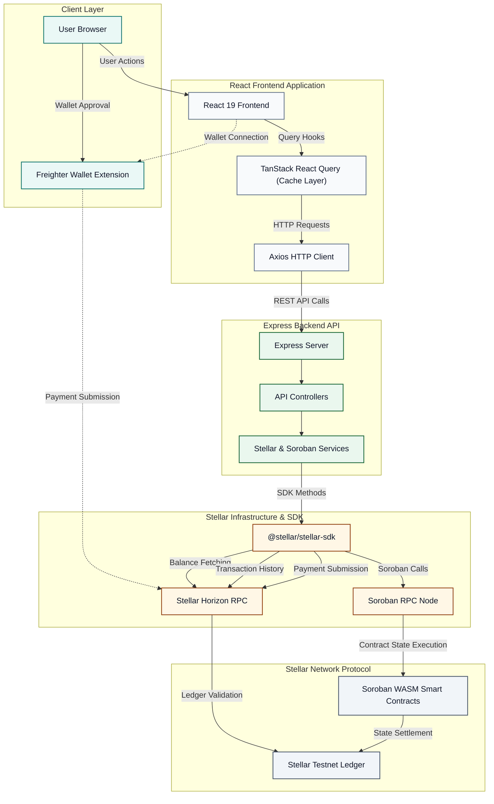

---

### Payment Sequence Flow

Below is the Mermaid sequence diagram detailing the full end-to-end payment lifecycle from wallet connection to on-chain settlement and balance refetching:

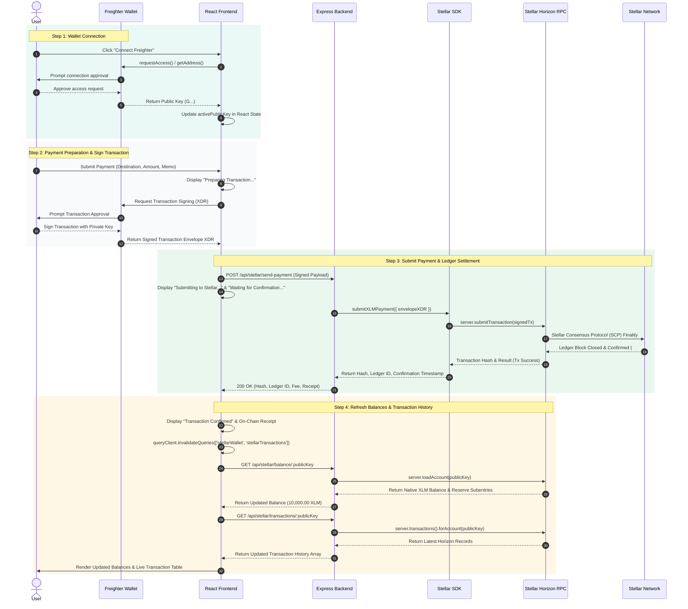

---

## 📡 API Endpoints

| Route Path | Method | Description |
| :--- | :--- | :--- |
| `GET /api/health` | `GET` | API Health Check and server uptime status |
| `GET /api/dashboard` | `GET` | Executive dashboard metrics and settlement statistics |
| `GET /api/devices` | `GET` | Fleet device list with status filtering and search |
| `POST /api/devices` | `POST` | Provision a new IoT hardware device endpoint |
| `GET /api/transactions` | `GET` | Transaction history ledger records |
| `GET /api/wallet` | `GET` | Unified wallet details for specified `publicKey` |
| `POST /api/wallet/send` | `POST` | Submit Stellar XLM payment payload |
| `GET /api/analytics` | `GET` | Historical throughput and network performance metrics |
| `GET /api/settings` | `GET` | Protocol and RPC network configuration |
| `PUT /api/settings` | `PUT` | Update protocol settings |
| `POST /api/stellar/create-wallet` | `POST` | Generate new Stellar Testnet keypair |
| `POST /api/stellar/fund-wallet` | `POST` | Fund public key with 10,000 Testnet XLM via Friendbot |
| `GET /api/stellar/balance/:publicKey` | `GET` | Load live Horizon account balance object |
| `POST /api/stellar/send-payment` | `POST` | Sign and submit Stellar XLM payment to Testnet |
| `GET /api/stellar/transactions/:publicKey` | `GET` | Horizon transaction history records |
| `GET /api/stellar/network` | `GET` | Stellar Core ledger sequence and fee stats |
| `POST /api/soroban/register-device` | `POST` | Register device terminal on-chain |
| `POST /api/soroban/create-settlement` | `POST` | Lock payment in Soroban escrow |
| `POST /api/soroban/execute-payment` | `POST` | Release Soroban escrow to recipient |
| `GET /api/soroban/settlements` | `GET` | Fetch all Soroban smart contract settlements |
| `GET /api/soroban/device/:id` | `GET` | Query device contract registry status |

---

## 📦 Local Development

### Prerequisites
- **Node.js**: `v18.0.0` or higher
- **npm**: `v9.0.0` or higher

### 1. Setup & Run Frontend Application
```bash
# Navigate to frontend directory
cd frontend

# Install dependencies
npm install

# Start Vite development server
npm run dev
```

### 2. Setup & Run Backend Service
```bash
# Navigate to backend directory
cd backend

# Install dependencies
npm install

# Start Express API server
npm start
```

---

## 🌍 Deployment

- **Frontend Application**: Deployed live on **Vercel** at [https://stellar-link-sigma.vercel.app](https://stellar-link-sigma.vercel.app)
- **Backend API Service**: Deployed live on **Render** at [https://stellarlink.onrender.com](https://stellarlink.onrender.com)
- **Smart Contracts**: Compiled and deployed live on **Stellar Testnet** via Soroban CLI

---

## 📷 Project Gallery

### Landing Page

#### Hero Section
  
*Landing Page Hero section highlighting autonomous Machine-to-Machine settlement features*

#### Features Section
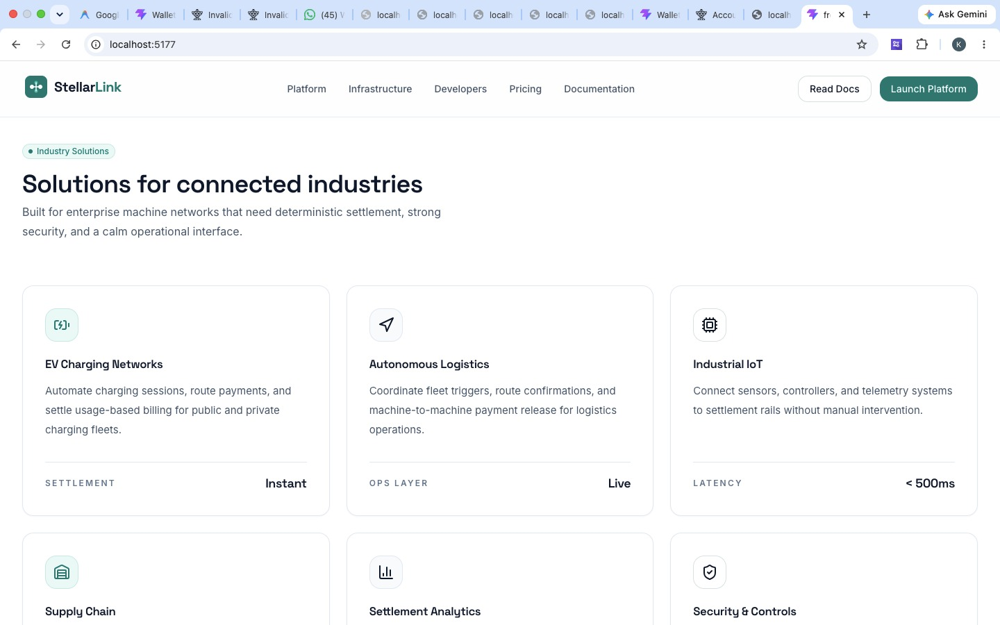  
*Features section detailing enterprise liquidity and Soroban smart contract capabilities*

---

### Executive Dashboard

  
*Executive Dashboard showing real-time ledger sequences, network status, and KPI summary cards*

---

### Wallet Management

#### Wallet Overview
  
*Digital Asset Vault displaying XLM balances, Freighter status, and keypair controls*

#### Transactions & Device Wallets
  
*Transaction History ledger table and active IoT device wallet listings*

---

### Analytics

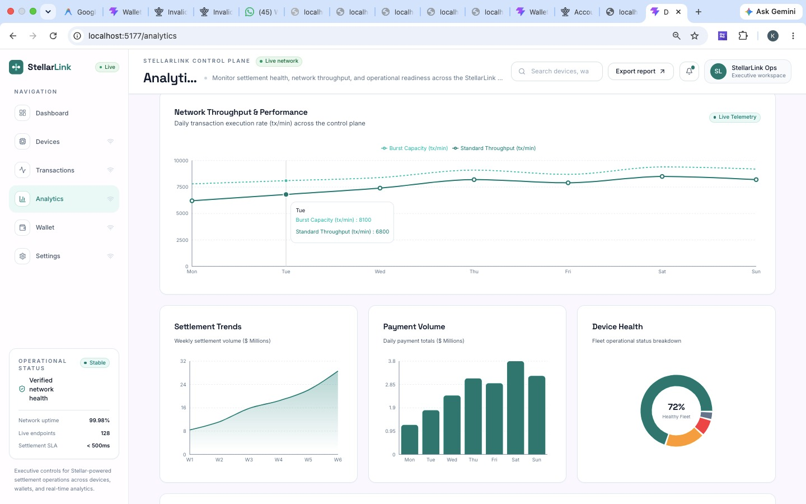  
*Analytics dashboard rendering network throughput, settlement SLAs, and device telemetry metrics*

---

### Mobile Responsive Design

#### Wallet Mobile
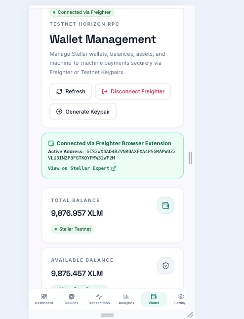  
*Mobile responsive layout for StellarLink Digital Asset Vault*

#### Devices Mobile
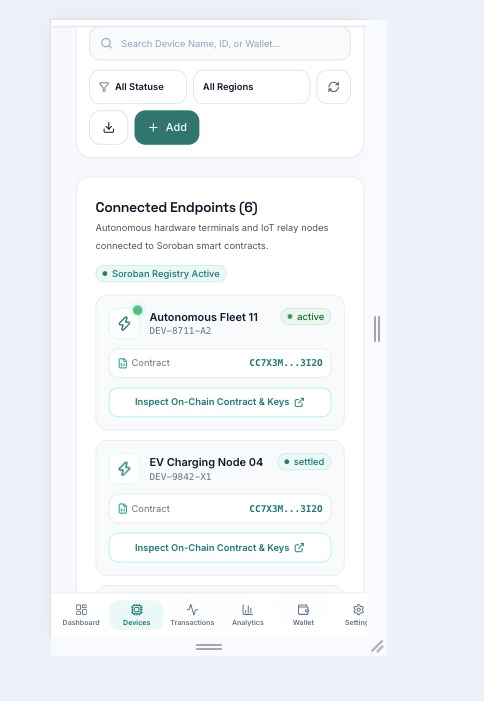  
*Mobile responsive view for Hardware Device Fleet management*

#### Settings Mobile
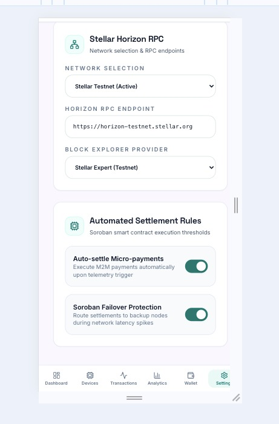  
*Mobile responsive view for Enterprise Protocol Settings*

---

## 👨‍💻 Author

**Developed by Karman Singh Chandhok**

- **GitHub**: [https://github.com/Karmansingh09](https://github.com/Karmansingh09)
- **LinkedIn**: [https://www.linkedin.com/in/karman-singh-chandhok-b1262337b](https://www.linkedin.com/in/karman-singh-chandhok-b1262337b)

---

## License

Distributed under the MIT License. See [`LICENSE`](LICENSE) for more information.

---

## Acknowledgements

- [Stellar Development Foundation (SDF)](https://stellar.org)
- [Soroban Smart Contracts Documentation](https://soroban.stellar.org)
- [Freighter Browser Wallet](https://www.freighter.app)
- [Stellar Expert Block Explorer](https://stellar.expert)
- [Recharts Library](https://recharts.org)
- [Framer Motion Animation Engine](https://www.framer.com/motion/)
