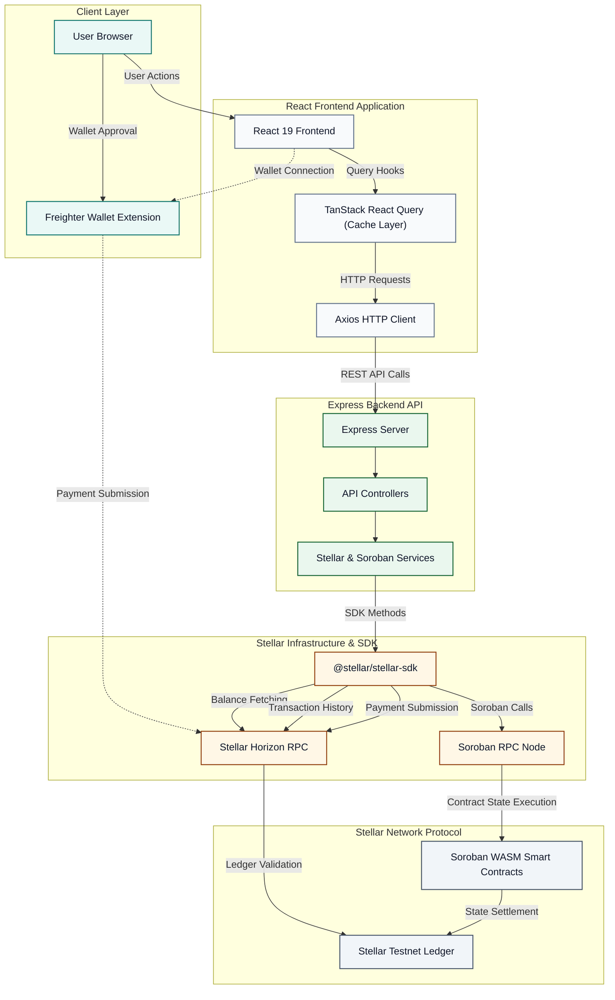
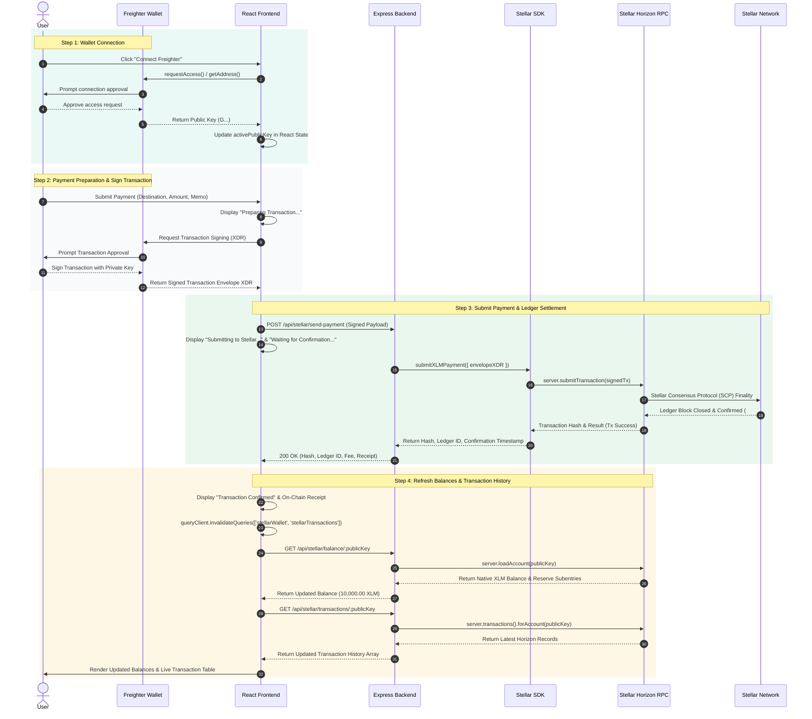

# StellarLink

A modern enterprise settlement platform powered by the Stellar Network.

[](https://react.dev/)
[](https://vitejs.dev/)
[](https://expressjs.com/)
[](https://developers.stellar.org/)
[](https://soroban.stellar.org/)
[](https://www.freighter.app/)
[](LICENSE)

---

## Overview

**StellarLink** is a production-grade enterprise software-as-a-service (SaaS) control plane designed for autonomous Machine-to-Machine (M2M) financial settlements, IoT hardware telemetry management, and decentralized digital asset liquidity on the Stellar Network.

By combining low-latency Stellar Horizon RPC APIs with Soroban smart contracts, StellarLink enables enterprises, fleet operators, microgrid energy networks, and automated retail networks to:
- **Manage Enterprise Liquidity**: Operate secure multi-asset Stellar vaults with real-time balance tracking, base reserve calculations, and multi-currency trustline monitoring.
- **Automate M2M Settlements**: Register IoT hardware endpoints, track real-time telemetry pulses, and execute automated sub-second payments.
- **Orchestrate Soroban Smart Contracts**: Deploy and interact with Rust-based Soroban smart contracts for device permissioning, trustless payment escrows, and automated batch settlements.
- **Monitor Network Health**: Track live Stellar ledger sequences, consensus finality speeds, and network base fee dynamics in real time via a 10-second auto-sync control center.

---

## Features

### Blockchain Features
- **Freighter Wallet Integration**: Connect browser extension wallets safely using `@stellar/freighter-api` with automatic network checking and graceful fallback states.
- **Stellar Horizon RPC**: Full integration with Stellar Horizon REST APIs for high-throughput account loading, ledger sequence queries, and fee stats.
- **1-Click Friendbot Funding**: Instant 10,000 Testnet XLM funding for newly generated keypairs.
- **Testnet Payment Engine**: Multi-stage fintech payment flow featuring *Preparing*, *Signing*, *Submitting*, *Waiting*, and *Confirmed* progress indicators.
- **Live Account Balances**: Real-time native XLM and token trustline balances computed dynamically minus Stellar base reserve requirements ($1.0\text{ XLM} + 0.5\text{ XLM} \times \text{subentries}$).
- **Ledger Transaction History**: Chronological, searchable payment activity with transaction hashes, fee breakdowns, and operation counts.
- **Stellar Expert Deep Links**: Single-click external explorer links for accounts, transactions, and Soroban contract IDs.

### Enterprise Features
- **Live Network Control Center**: Executive dashboard displaying active ledgers, protocol versions (`v21`), consensus speeds, and animated KPI metrics.
- **Digital Asset Management**: Vault management interface supporting send/receive operations, QR code generation, secret key toggles, and asset allocation views.
- **Device Fleet Management**: Terminal console for hardware endpoints (EV Chargers, Autonomous Robots, Microgrids, Sensors) with debounced search, filtering, and detail drawers.
- **Analytics & Reporting**: Interactive multi-period Recharts line, area, bar, and donut charts with date range controls and report export capabilities.
- **Settlement Monitoring**: Real-time telemetry event stream tracking machine payment flows.
- **Enterprise Settings**: Protocol configuration, RPC endpoint selectors, network toggles (*Testnet* / *Mainnet*), and unsaved changes protection.

### Soroban Smart Contracts
- **Device Registry (`device_registry`)**: On-chain hardware registration, metadata hashing, and status toggles.
- **Payment Escrow (`payment_escrow`)**: Trustless locking, automated release, and refund mechanisms for high-value machine settlements.
- **Settlement Manager (`settlement_manager`)**: On-chain batch settlement creation and execution history.
- **Device Permissions (`device_permissions`)**: Role-based access control (RBAC), authorization grants, and revocation for machine terminals.

---

## Screenshots

| Dashboard Control Center | Fleet Device Management |
| :---: | :---: |
|  |  |

| Digital Asset Vault | Multi-Stage Payment Flow |
| :---: | :---: |
|  |  |

---

## Architecture

Below is the GitHub-compatible Mermaid architecture flowchart of the StellarLink control plane:



---

### Payment Sequence Flow

Below is the Mermaid sequence diagram detailing the full end-to-end payment lifecycle from wallet connection to on-chain settlement and balance refetching:



---

## Tech Stack

### Frontend
- **Framework**: React 19, Vite 8, React Router v7
- **Styling**: Tailwind CSS v4, Framer Motion (Page Entrance & Modal Animations)
- **Data Fetching & Caching**: TanStack React Query v5, Axios
- **Charts & Telemetry**: Recharts v3
- **Icons**: Lucide React

### Backend
- **Runtime**: Node.js v24, Express 4
- **Security & Middleware**: CORS, Dotenv, Global Error Handler
- **Architecture**: Modular Controller & Service pattern

### Blockchain & Smart Contracts
- **Stellar SDK**: `@stellar/stellar-sdk` (`v12.4.0`)
- **Smart Contracts**: Soroban Rust WebAssembly Contracts (`device_registry`, `payment_escrow`, `settlement_manager`, `device_permissions`)
- **Stellar Network**: Stellar Testnet Horizon (`https://horizon-testnet.stellar.org`)

### Wallet Integration
- **Browser Extension**: `@stellar/freighter-api` (`v2.0.2`)
- **Keypair Engine**: `StellarSdk.Keypair` random generation & Friendbot integration

### Infrastructure
- **Module Bundler**: Vite 8
- **Code Quality**: ESLint, Prettier, Production Error Boundaries

---

## Folder Structure

```
stellarlink/
├── backend/
│   ├── src/
│   │   ├── controllers/       # Express request handlers
│   │   ├── routes/            # API endpoints (/api/stellar, /api/soroban, etc.)
│   │   ├── services/          # Business logic & Stellar Horizon client
│   │   │   ├── soroban/       # On-chain contract services
│   │   │   └── stellar/       # Horizon RPC & keypair services
│   │   └── server.js          # Express app entry point
│   ├── .env.example
│   └── package.json
├── contracts/                 # Soroban Rust Smart Contracts
│   ├── device_permissions/
│   ├── device_registry/
│   ├── payment_escrow/
│   └── settlement_manager/
├── docs/                      # Architectural specs & media assets
│   ├── architecture/
│   ├── diagrams/
│   └── screenshots/
└── frontend/
    ├── src/
    │   ├── components/        # Reusable UI components by feature area
    │   ├── context/           # React Context providers (ToastContext)
    │   ├── hooks/             # Custom React Query hooks (useStellar, useWallet)
    │   ├── layouts/           # App shell layouts (DashboardLayout, LandingLayout)
    │   ├── pages/             # Main page routes (Dashboard, Devices, Wallet, etc.)
    │   ├── routes/            # AppRouter & Lazy-loaded routes
    │   └── services/          # Frontend Axios & Freighter API services
    ├── index.html
    ├── package.json
    └── vite.config.js
```

---

## Installation

### Prerequisites
- **Node.js**: `v18.0.0` or higher
- **npm**: `v9.0.0` or higher

### 1. Clone Repository & Setup Backend
```bash
cd stellarlink/backend
npm install
```

Create a `.env` file in `stellarlink/backend/`:
```env
PORT=5001
STELLAR_HORIZON_URL=https://horizon-testnet.stellar.org
SOROBAN_RPC_URL=https://soroban-testnet.stellar.org
```

Start the Backend API Server:
```bash
npm start
```

### 2. Setup Frontend Application
```bash
cd stellarlink/frontend
npm install
```

Create a `.env` file in `stellarlink/frontend/`:
```env
VITE_API_BASE_URL=http://localhost:5001/api
```

Start the Vite Frontend Development Server:
```bash
npm run dev
```

---

## Usage

### Connecting Freighter Wallet
1. Ensure the **Freighter Browser Extension** is installed in Chrome/Brave from [freighter.app](https://www.freighter.app/).
2. Navigate to the **Wallet** tab (`/wallet`) in StellarLink.
3. Click **Connect Freighter** in the header toolbar.
4. Approve the access prompt in Freighter.
5. The application will set `activePublicKey` to your connected address and immediately refetch all balances and transactions.

### Generating Testnet Keypairs
1. On the **Wallet** tab, click **Generate Testnet Keypair**.
2. A new secret/public keypair will be generated locally.
3. The public key is loaded as `activePublicKey` and displays an unfunded balance (`0.00 XLM`).

### Friendbot 1-Click Funding
1. With any generated or unfunded keypair active, click **Fund Friendbot**.
2. The platform sends a funding request to `https://friendbot.stellar.org`.
3. Account balance updates to `10,000.00 XLM` (`9,999.00 XLM` Available Balance) in real time.

### Sending XLM Payments
1. Click **Send XLM** on the Wallet page hero card.
2. Enter the destination Public Key (`G...`), XLM Amount, and optional Memo text.
3. Click **Initiate Payment Flow**.
4. Observe the multi-stage lifecycle animation (*Preparing*, *Signing*, *Submitting*, *Waiting*, *Confirmed*).
5. Review the on-chain receipt including Transaction Hash, Ledger Number, and Stellar Expert deep link.

---

## API Endpoints

| Route Path | Method | Description |
| :--- | :--- | :--- |
| `GET /api/health` | `GET` | API Health Check and uptime timestamp |
| `GET /api/dashboard` | `GET` | Executive dashboard metrics and settlement stats |
| `GET /api/devices` | `GET` | Fleet device list with filtering and search |
| `POST /api/devices` | `POST` | Provision a new IoT device endpoint |
| `GET /api/transactions` | `GET` | Transaction history ledger records |
| `GET /api/wallet` | `GET` | Unified wallet details for specified `publicKey` |
| `POST /api/wallet/send` | `POST` | Submit Stellar XLM payment payload |
| `GET /api/analytics` | `GET` | Historical throughput and network performance metrics |
| `GET /api/settings` | `GET` | Protocol and RPC network configuration |
| `PUT /api/settings` | `PUT` | Update protocol settings |
| `POST /api/stellar/create-wallet` | `POST` | Generate new Stellar Testnet keypair |
| `POST /api/stellar/fund-wallet` | `POST` | Fund public key with 10,000 Testnet XLM via Friendbot |
| `GET /api/stellar/balance/:publicKey` | `GET` | Load live Horizon account balance object |
| `POST /api/stellar/send-payment` | `POST` | Sign and submit Stellar XLM payment to Testnet |
| `GET /api/stellar/transactions/:publicKey` | `GET` | Horizon transaction history records |
| `GET /api/stellar/network` | `GET` | Stellar Core ledger sequence and fee stats |
| `POST /api/soroban/register-device` | `POST` | Register device terminal on-chain |
| `POST /api/soroban/create-settlement` | `POST` | Lock payment in Soroban escrow |
| `POST /api/soroban/execute-payment` | `POST` | Release Soroban escrow to recipient |
| `GET /api/soroban/settlements` | `GET` | Fetch all Soroban smart contract settlements |
| `GET /api/soroban/device/:id` | `GET` | Query device contract registry status |

---

## Future Roadmap

- [ ] **Soroban CLI Automated Deployment**: Integrated CLI scripts for auto-compiling Rust contracts into WebAssembly and deploying directly to Testnet/Mainnet.
- [ ] **Multi-Signature Treasury Workflows**: Support 2-of-3 and 3-of-5 threshold signatures for high-value enterprise vault transfers.
- [ ] **Anchored Fiat On/Off Ramps**: Direct SEP-24 / SEP-31 integration with Stellar anchors for USDC and fiat liquidity.
- [ ] **WebSockets Ledger Stream**: Real-time push notifications for incoming ledger transactions.
- [ ] **Hardware Security Module (HSM) Key Storage**: KMS integration for enterprise AWS/GCP key enclaves.

---

## License

Distributed under the MIT License. See [`LICENSE`](LICENSE) for more information.

---

## Acknowledgements

- [Stellar Development Foundation (SDF)](https://stellar.org)
- [Soroban Smart Contracts Documentation](https://soroban.stellar.org)
- [Freighter Browser Wallet](https://www.freighter.app)
- [Stellar Expert Block Explorer](https://stellar.expert)
- [Recharts Library](https://recharts.org)
- [Framer Motion Animation Engine](https://www.framer.com/motion/)
